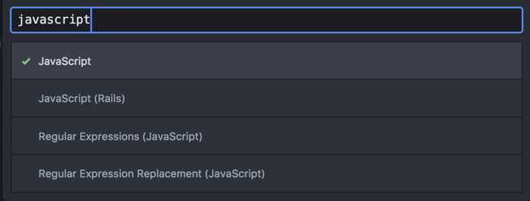

# Integrated Development Environment - (IDE)

## Summary

In this lesson we will go over what an IDE is, explore options, and get you setup for Web Development.

In simple terms an IDE is a text editor that allows programmers to write their source code. An IDE may look a lot like a text editor, such as Microsoft word, but the fundamental difference is that the main goal of an IDE is to increase the productivity environment for the programmer. Therefore, some IDE may have syntax highlighting for your programming language, build tools to run your program, or even graphical user interfaces (GUI) that allows you perform programming task by clicking a button.

As there are many different languages and a variety of platforms to program on, there are a lot of choices for an IDE. Think of an IDE as a tool that developers use to fit the need of a task.

For web development there are a lot of options, but the most popular choices are Sublime, Atom, and Vim.

Sublime and Atom are very similar. Atom is completely free, while Sublime has a free version and a paid version. Vim is another IDE that a lot of advanced programmers will swear by. You get major programming props if you are a master Vim user. However, My recommendation is to not start with Vim, but you should definitely look into it later.

We will be using Atom for our class and the following instructions will be setting up your IDE using Atom.

## Exercise

1. Download Atom from [https://atom.io/](https://atom.io/) and install it
2. Play around with the IDE

A few areas I want to address is the File Tree and the File Types

**File Tree:**

Located by default on the left side of the IDE, this pane is a tree representation of your file structure. You can toggle this pane by hitting <kbd>command</kbd> + <kbd>k</kbd> first then press <kbd>b</kbd>

**File Types**

Located by default on the bottom right of the IDE this pane is to see your current file type. Do not worry about what this means right now. Just know that you can change this file type by either clicking the programming language, for our chase javascript, or hit <kbd>ctrl</kbd> + <kbd>shift</kbd> + <kbd>l</kbd> and then a window like the image below will popup

Type in the file type you would like to change into. This will not change the actual file, but it will change how the IDE will highlight the syntax.

**Package Installer**

Now one of the most important part of Atom would be the package install. Atom is a hackable IDE. This means that you will be able to add additional functionality to it. Also you can install plugins that the community developed. There are tons of plugins out there and right now we will not install any plugins, but future lesson may require you to install packages.

You can open the package installer by hitting <kbd>command</kbd> + <kbd>,</kbd> and clicking install, or navigating to it e.a. /Atom/Preferences. Just search for what you want and click the install button.

For this exercise, just get familar with Atom and look into a few shortcuts that will help you improve your productivity in the future. My recommendation is the print out the Atom shortcuts cheat sheet below and tape it to your table. Focus on maybe one shortcut a week and try to use it rather than the GUI.

## Additional Resource

[Wiki IDE](https://en.wikipedia.org/wiki/Integrated_development_environment)

[Atom shortcuts cheat sheet](http://d2wy8f7a9ursnm.cloudfront.net/atom-editor-cheat-sheet.pdf)
